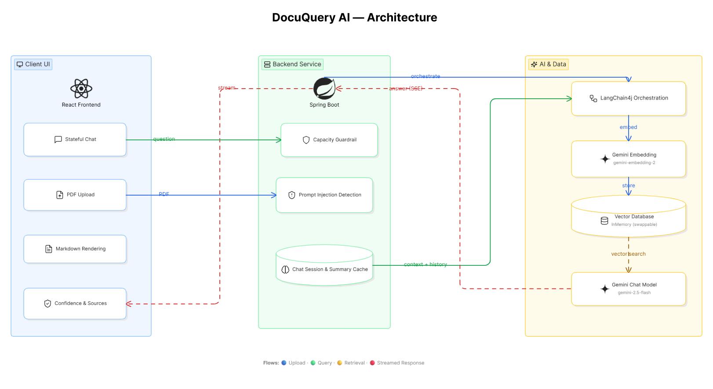

# DocuQuery AI — Enterprise Document Intelligence

> Upload a PDF. Extract structured insights. Ask questions. Get auditable, real-time AI answers.

**Live Demo →** [documentquery.vercel.app](https://documentquery.vercel.app/) &nbsp;|&nbsp; **API Status →** [/api/health](https://docuquery-api-idh9.onrender.com/api/health)




---

## What is DocuQuery AI?

DocuQuery AI is a full-stack Retrieval-Augmented Generation (RAG) platform that transforms unstructured PDF documents into structured, queryable, and fully auditable intelligence. It combines a Spring Boot microservice backend with a React frontend and Google Gemini AI to deliver a production-grade document assistant with real-time streaming, session memory, and enterprise guardrails.

---

## Features

| Feature | Description |
|---|---|
| **Real-time streaming** | Chat responses stream token-by-token via Server-Sent Events (SSE), delivering <500ms first-token latency |
| **Stateful RAG memory** | Maintains isolated multi-turn chat histories for up to 5 concurrent document sessions |
| **Zero hallucination UI** | Every answer is paired with a vector **Relevance Score** and an expandable source viewer showing the exact PDF chunks used |
| **Structured metadata extraction** | Declarative AI forces the LLM to return strictly typed JSON — document type, executive summary, and key entities |
| **Capacity guardrail** | Hard cap of 5 active documents prevents Out-of-Memory crashes on the 512MB free-tier container |
| **Prompt injection detection** | Pre-LLM validation layer blocks malicious instructions before they reach the model |
| **Graceful degradation** | Falls back to returning raw vector context if the Gemini API is unavailable or rate-limited |
| **Tri-layer soft deletion** | Document deletion clears raw text, summary cache, chat history, and applies a soft-delete vector filter — all atomically |

---

## Architecture Overview

```
┌─────────────────────┐     REST / SSE      ┌──────────────────────┐     LangChain4j     ┌─────────────────────┐
│    Client Tier      │ ──────────────────► │  Application Layer   │ ──────────────────► │   AI & Data Layer   │
│                     │                     │                      │                     │                     │
│  React + Vite       │ ◄── SSE Token Stream│  Spring Boot 3       │ ◄── Answer Stream   │  LangChain4j 0.36   │
│  Vercel             │                     │  Render              │                     │  Google Gemini API  │
└─────────────────────┘                     └──────────────────────┘                     └─────────────────────┘
```

### Client Tier — React (Vercel)
- **Document Library** — tracks up to 5 active documents with filenames, timestamps, and instant context switching
- **Structured Output tab** — renders cached JSON metadata (document type, summary, entities)
- **RAG Assistant tab** — scrolling chat UI with `react-markdown` rendering, relevance score badges, and expandable source accordions
- **SSE decoder** — native Fetch API stream reader that renders tokens in real time as they arrive

### Application Layer — Spring Boot 3 (Render)
- **Request Logging Filter** — logs HTTP method, URI, status, and latency (ms) on every request
- **Global Exception Handler** — maps all exceptions to structured JSON error responses with correct HTTP status codes (400, 404, 413, 429, 500)
- **DocumentService** — PDF extraction via Apache PDFBox, UUID generation, capacity guardrail, raw text storage
- **RAGService** — prompt injection detection, semantic search with metadata filtering, context assembly, session memory management, SSE streaming orchestration, graceful degradation
- **State stores** — three in-memory `ConcurrentHashMap` instances for raw text, summary cache, and chat sessions; plus a `Set` for soft-deleted document IDs

### AI & Data Layer — LangChain4j + Gemini
- **Ingestion** — recursive `DocumentSplitter` (1000 chars / 150 overlap) reduces Gemini embedding calls by 60%+ vs defaults
- **Embedding** — `GoogleAiEmbeddingModel` with `gemini-embedding-2`
- **Vector store** — `InMemoryEmbeddingStore` coded to the `EmbeddingStore<TextSegment>` interface — swap to `pgvector` or Pinecone in production with zero service-layer changes
- **Declarative extraction** — LangChain4j `AiServices` maps Gemini output directly to a `DocumentSummary` Java record via `@SystemMessage` annotations
- **Streaming chat** — `GoogleAiGeminiStreamingChatModel` (`gemini-2.5-flash`, temperature 0.3) with per-document session memory capped at 6 messages (3 turns)

---

## Tech Stack

**Backend:** Java 21 · Spring Boot 3.4 · LangChain4j 0.36.2 · Apache PDFBox · Maven

**Frontend:** React · Vite · Axios · Fetch API (SSE) · react-markdown · Lucide Icons

**AI:** Google Gemini (`gemini-2.5-flash` · `gemini-embedding-2`)

**Infrastructure:** Render · Vercel · GitHub CI/CD · cron-job.org (keep-alive)

---

## Running Locally

### Prerequisites
- Java 21+
- Node.js 18+
- A [Google Gemini API key](https://aistudio.google.com/)

### 1. Backend

```bash
cd docuquery-api
export GEMINI_API_KEY="your_api_key_here"
mvn spring-boot:run
```

Backend starts at `http://localhost:8080`. Verify with `GET /api/health`.

### 2. Frontend

```bash
cd docuquery-ui
npm install
npm run dev
```

Frontend starts at `http://localhost:5173`.

> **Note:** The frontend's Axios base URL points to the live Render backend by default. To use your local backend, update the API base URL in `src/App.jsx` to `http://localhost:8080`.

---

## API Reference

| Method | Endpoint | Description |
|---|---|---|
| `POST` | `/api/documents/upload` | Upload a PDF — returns `documentId` |
| `GET` | `/api/documents/{id}/summary` | Get structured JSON metadata |
| `POST` | `/api/documents/{id}/query` | Stream a RAG answer (SSE) |
| `DELETE` | `/api/documents/{id}` | Tri-layer document deletion |
| `GET` | `/api/documents/{id}/chat/history` | Fetch conversation history |
| `DELETE` | `/api/documents/{id}/chat/reset` | Clear chat session only |
| `GET` | `/api/health` | Service health check |

---

## Project Structure

```
docuquery/
├── docuquery-api/                  # Spring Boot backend
│   └── src/main/java/com/docuquery/api/
│       ├── config/                 # LangChain4j bean configuration
│       ├── controller/             # REST endpoints
│       ├── exception/              # Global error handling
│       ├── model/                  # Java Records (DTOs)
│       └── service/                # DocumentService · RAGService · MetadataExtractor
└── docuquery-ui/                   # React frontend
    └── src/
        ├── App.jsx                 # Main component + state management
        └── App.css                 # Layout and component styles
```

---

## Design Notes

**On the vector store:** `InMemoryEmbeddingStore` was a deliberate choice for the free-tier deployment. Because all service code is written against the `EmbeddingStore<TextSegment>` interface, swapping to `pgvector` or Pinecone in production requires changing exactly one Spring `@Bean` definition.

**On soft deletion:** LangChain4j 0.36.x has no native delete-by-metadata API on the in-memory store. The `deletedDocumentIds` Set acts as a runtime filter applied at vector search time, correctly isolating deleted documents without requiring a store rebuild.

**On session memory:** Chat history is capped at 6 messages (3 turns) per document. This balances conversational context with token budget — passing unbounded history would rapidly exhaust the Gemini free tier quota.

**On streaming latency:** The switch from blocking `ChatLanguageModel` to `StreamingChatLanguageModel` + `SseEmitter` reduced perceived response latency from ~6 seconds to <500ms for the first token, which is the standard production expectation for LLM chat interfaces.
